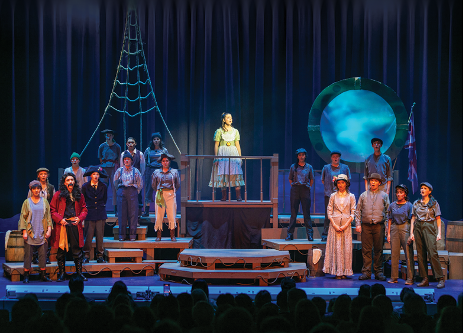

# BMC V3 Component Framework

A lightweight, reusable CSS component and utility framework for Bishop Moore Catholic web pages.

The framework is scoped beneath the `.bmc-v3` namespace so it can be added to existing pages without unintentionally changing unrelated site elements.

## Included Files

| File | Purpose |
|---|---|
| `bmc-v3.css` | Scoped component and utility framework |
| `index.html` | Visual boilerplate and component gallery |
| `usage.html` | Bootstrap-style usage guide and class reference |
| `assets/images/` | Local demonstration images used by the boilerplate |

## Quick Start

### 1. Add the stylesheet

```html
<link rel="stylesheet" href="bmc-v3.css">
```

When the stylesheet is stored in another directory, update the path as needed:

```html
<link rel="stylesheet" href="/editoruploads/css/bmc-v3.css">
```

### 2. Add the framework namespace

Wrap framework content in an element with the `.bmc-v3` class:

```html
<div class="bmc-v3">
  <section class="bmc-section">
    <div class="bmc-container">
      <h2 class="bmc-heading-1">
        Build <strong>Something Moore</strong>
      </h2>

      <p class="bmc-lead">
        Add responsive BMC components without affecting the rest of the website.
      </p>
    </div>
  </section>
</div>
```

All framework selectors are scoped beneath `.bmc-v3`.

## Buttons

For linked buttons on the Bishop Moore website, use both the framework class and the website's existing `.button` class:

```html
<a class="bmc-btn button" href="#">
  Learn More
</a>
```

### Button variants

```html
<a class="bmc-btn button" href="#">Primary</a>

<a class="bmc-btn bmc-btn-dark button" href="#">
  Dark
</a>

<a class="bmc-btn bmc-btn-outline button" href="#">
  Outline
</a>
```

The dark button displays white text on black by default and changes to black text on gold when hovered or focused.

## Responsive Grid

The framework includes a Bootstrap-style 12-column responsive grid:

```html
<div class="bmc-row bmc-g-3">
  <div class="bmc-col-12 bmc-col-md-6">
    <div class="bmc-card">First column</div>
  </div>

  <div class="bmc-col-12 bmc-col-md-6">
    <div class="bmc-card">Second column</div>
  </div>
</div>
```

## Component Examples

The framework includes reusable components for:

- Buttons
- Cards
- Pills
- Hexagons
- Quotes and testimonials
- Statistics
- Responsive videos
- Image and legacy cards
- Tables
- Heroes
- Section headings
- Responsive columns and grids
- Typography and alignment utilities
- Spacing, display, flex, width, and visibility utilities

Open `index.html` to view the component gallery.

Open `usage.html` for the full class and component reference.

## GitHub Pages Structure

Upload the project folder as a unit:

```text
bmc-v3-framework/
├── index.html
├── usage.html
├── bmc-v3.css
├── README.md
└── assets/
    └── images/
        ├── hero-stage.png
        ├── legacy-football-historic.png
        ├── legacy-science-historic.jpg
        └── legacy-science-current.jpg
```

All demonstration images use relative paths:

```html

```

This allows the framework to work from a GitHub Pages project directory or subdirectory without changing image URLs.

## Design Conventions

- All components use square corners.
- Pills are rectangular rather than rounded.
- Colors and spacing are controlled through framework variables.
- Components are responsive by default.
- Framework styles remain scoped beneath `.bmc-v3`.
- Reduced-motion preferences are respected.
- Utility classes follow a Bootstrap-inspired naming pattern.

## Documentation

- [`index.html`](index.html) — component gallery and boilerplate
- [`usage.html`](usage.html) — usage guide and complete class reference
- [`bmc-v3.css`](bmc-v3.css) — framework stylesheet

## Basic Page Template

```html
<!doctype html>
<html lang="en">
<head>
  <meta charset="utf-8">
  <meta name="viewport" content="width=device-width, initial-scale=1">
  <title>BMC V3 Page</title>

  <link rel="stylesheet" href="bmc-v3.css">
</head>
<body>
  <main class="bmc-v3">
    <section class="bmc-section">
      <div class="bmc-container">
        <span class="bmc-eyebrow">Bishop Moore Catholic</span>

        <h1 class="bmc-heading-1">
          Page <strong>Title</strong>
        </h1>

        <p class="bmc-lead">
          Add page content here.
        </p>

        <a class="bmc-btn button" href="#">
          Call to Action
        </a>
      </div>
    </section>
  </main>
</body>
</html>
```
