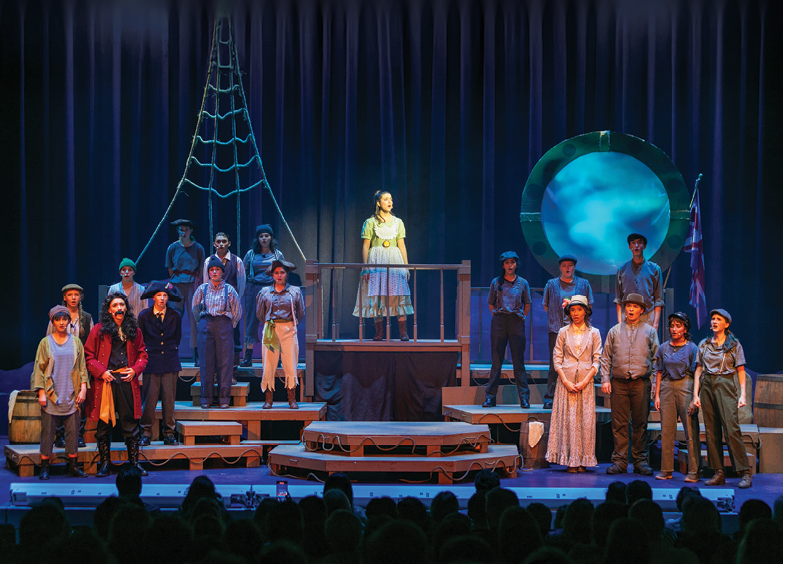

# BMC V3 Component Framework

A lightweight, reusable CSS component and utility framework for Bishop Moore Catholic web pages.

The framework is scoped beneath the `.bmc-v3` namespace so it can be added to existing pages without unintentionally changing unrelated site elements.

## Relationship to BMC-CSS

MooreKit was originally designed for pages that also loaded [`BMC-CSS`](https://github.com/Bishop-Moore-Catholic/BMC-CSS), the site-wide correction stylesheet for the Bishop Moore Catholic CMS. BMC-CSS supplies the Adobe Fonts kit and also contains global typography rules, navigation fixes, editor-content corrections, and CMS-specific responsive patches.

MooreKit now includes the portable foundation it needs—brand font loading, fallback font stacks, scoped typography, responsive media defaults, layout primitives, controls, and accessibility behavior—so **BMC-CSS is not required for MooreKit components**. Existing CMS pages may continue to load BMC-CSS for its site-shell and CMS corrections.

The Adobe Fonts kit is loaded by `bmc-v3.css` from `use.typekit.net`. If that network resource is unavailable, MooreKit uses its documented system fallback stack. See [`docs/bmc-css-independence.md`](docs/bmc-css-independence.md) for the upstream audit and boundary.

## Included Files

| File | Purpose |
|---|---|
| `bmc-v3.css` | Scoped component and utility framework |
| `bmc-v3.min.css` | Minified framework stylesheet |
| `bmc-v3.js` | Optional carousel initializer for `[data-bmc-carousel]` components |
| `index.html` | Root GitHub Pages component gallery |
| `docs/index.html` | Bootstrap-style usage guide and class reference |
| `docs/examples.html` | Visual boilerplate and component gallery |
| `docs/team-timeline.html` | Team timeline example |
| `docs/left-timeline.html` | Left timeline example |
| `docs/bmc-css-independence.md` | BMC-CSS dependency audit and standalone boundary |
| `assets/images/` | Local demonstration images used by the boilerplate |

## Quick Start

### 1. Add the stylesheet

```html
<link rel="stylesheet" href="bmc-v3.css">
```

When the stylesheet is stored in another directory, update the path as needed:

```html
<link rel="stylesheet" href="/editoruploads/css/bmc-v3.css">
```

Load the JavaScript file once on pages that use carousels:

```html
<script src="bmc-v3.js" defer></script>
```

### 2. Add the framework namespace

Wrap framework content in an element with the `.bmc-v3` class:

```html
<div class="bmc-v3">
  <section class="bmc-section">
    <div class="bmc-container">
      <h2 class="bmc-heading-1">
        Build <strong>Something Moore</strong>
      </h2>

      <p class="bmc-lead">
        Add responsive BMC components without affecting the rest of the website.
      </p>
    </div>
  </section>
</div>
```

All framework selectors are scoped beneath `.bmc-v3`.

## Buttons

Use MooreKit's namespaced `.bmc-btn` class by itself. Do not add the website's generic `.button` class, because site-level button rules can override MooreKit variants:

```html
<a class="bmc-btn" href="#">
  Learn More
</a>
```

### Button variants

```html
<a class="bmc-btn" href="#">Primary</a>

<a class="bmc-btn bmc-btn-dark" href="#">
  Dark
</a>

<a class="bmc-btn bmc-btn-outline" href="#">
  Outline
</a>

<a class="bmc-btn bmc-btn-sm" href="#">
  Small
</a>

<a class="bmc-btn bmc-btn-lg" href="#">
  Large
</a>
```

The `bmc-btn-sm` and `bmc-btn-lg` size modifiers change the button's min-height, padding, and text size. The dark displays white text on black by default and changes to black text on gold when hovered or focused.

## Responsive Grid

The framework includes a Bootstrap-style 12-column responsive grid:

```html
<div class="bmc-row bmc-g-3">
  <div class="bmc-col-12 bmc-col-md-6">
    <div class="bmc-card">First column</div>
  </div>

  <div class="bmc-col-12 bmc-col-md-6">
    <div class="bmc-card">Second column</div>
  </div>
</div>
```

## Alternating Grid Utility

Use `bmc-grid-alternate` to place direct children in alternating left and right columns on screens 992px and wider. The items automatically collapse into one column on smaller screens.

```html
<div class="bmc-grid-alternate bmc-gap-4">
  <article>First item: left</article>
  <article>Second item: right</article>
  <article>Third item: left</article>
</div>
```

Add `bmc-grid-alternate-align` to right-align odd items and left-align even items on large screens. Mobile text returns to left alignment.

Text alignment utilities include `bmc-text-left`, `bmc-text-center`, `bmc-text-right`, `bmc-text-start`, and `bmc-text-end`, plus responsive `sm`, `md`, and `lg` variants for left, center, and right alignment.

## Component Examples

The framework includes reusable components for:

- Buttons
- Cards
- Pills
- Hexagons
- Quotes and testimonials
- Statistics
- Responsive videos
- Image and legacy cards
- Image-card carousels
- Editorial and storytelling components
- Tables
- Heroes
- Section headings
- Responsive columns and grids
- Typography and alignment utilities
- Spacing, display, flex, width, and visibility utilities

Open `index.html` to view the root GitHub Pages component gallery.

Open `docs/index.html` for the full class and component reference.

### Image-card carousel

Load `bmc-v3.js` once, then add `data-bmc-carousel` to the carousel root. The component shows three cards on desktop, two on tablet, and one on mobile. It supports scrolling, previous/next controls, keyboard navigation, status text, reduced-motion preferences, and optional looped navigation.

```html
<div class="bmc-carousel" data-bmc-carousel data-bmc-carousel-loop="true">
  <div class="bmc-carousel-header">
    <div>
      <span class="bmc-eyebrow">The latest from Imagine Moore</span>
      <h2 class="bmc-heading-2">Project <strong>Updates</strong></h2>
    </div>

    <div class="bmc-carousel-actions" aria-label="Carousel controls">
      <button class="bmc-carousel-button" type="button" data-bmc-carousel-prev aria-label="Previous">
        <span aria-hidden="true">&#8592;</span>
      </button>
      <button class="bmc-carousel-button" type="button" data-bmc-carousel-next aria-label="Next">
        <span aria-hidden="true">&#8594;</span>
      </button>
    </div>
  </div>

  <div class="bmc-carousel-viewport" data-bmc-carousel-viewport tabindex="0" aria-label="Project updates">
    <ul class="bmc-carousel-track" data-bmc-carousel-track>
      <li class="bmc-carousel-slide" data-bmc-carousel-slide>
        <article class="bmc-image-card">
          <div class="bmc-image-card-media bmc-image-card-media-landscape">
            
          </div>
          <div class="bmc-image-card-body">
            <p class="bmc-carousel-meta">July 2026</p>
            <h3 class="bmc-carousel-title">Update Title</h3>
            <p>Short update copy.</p>
          </div>
        </article>
      </li>
    </ul>
  </div>

  <p class="bmc-carousel-status" data-bmc-carousel-status aria-live="polite"></p>
</div>
```

Looping is disabled by default; add `data-bmc-carousel-loop="true"` for wraparound navigation. Media stages support `bmc-image-card-media-landscape`, `bmc-image-card-media-portrait`, and `bmc-image-card-media-square`. Images and videos preserve their full frame by default; add `bmc-image-card-media-cover` when intentional cropping is preferred. For YouTube embeds that should pause when they leave view, add `?enablejsapi=1` to the embed URL and include `data-bmc-video` on the `iframe`.

For dynamically inserted carousel markup, run:

```js
window.MooreKit.initCarousels(containerElement);
```

### Editorial and storytelling components

Use the `bmc-v3-*` editorial components for alumni profiles, honoree features, campaign stories, admissions stories, development pages, news features, and faculty or student profiles. These components work independently and do not require JavaScript.

Available components include:

- `bmc-v3-eyebrow`
- `bmc-v3-image-frame`
- `bmc-v3-editorial-intro`
- `bmc-v3-story-header`
- `bmc-v3-pullquote`
- `bmc-v3-bio`
- `bmc-v3-stats` and `bmc-v3-stat`
- `bmc-v3-split-hero`
- `bmc-v3-split-list` and `bmc-v3-split`
- `bmc-v3-supporter`
- `bmc-v3-cta-band`
- `bmc-v3-story-divider`
- `bmc-list-columns-2`

Example:

```html
<header class="bmc-v3-story-header">
  <p class="bmc-v3-story-header__eyebrow">Alumni Spotlight</p>
  <h1 class="bmc-v3-story-header__title">A Meaningful Story Title</h1>
  <p class="bmc-v3-story-header__lead">
    A concise introduction that summarizes the feature.
  </p>
  <div class="bmc-v3-story-header__meta">
    <span>By Bishop Moore Catholic</span>
    <time datetime="2026-07-20">July 20, 2026</time>
  </div>
</header>
```

For a bold landing-page sequence, pair the split hero with alternating media-and-copy sections. The media stage crops by default; add `bmc-v3-split__media--contain` for logos or other artwork that should remain fully visible on a white background.

```html
<header class="bmc-v3-split-hero">
  <div class="bmc-container bmc-v3-split-hero__inner">
    <div class="bmc-v3-split-hero__copy">
      <h1 class="bmc-v3-split-hero__title">Programs of <strong>Distinction</strong></h1>
      <p class="bmc-v3-split-hero__lead">A concise introduction to the program collection.</p>
    </div>
    <figure class="bmc-v3-split-hero__mark">
      
    </figure>
  </div>
</header>

<div class="bmc-v3-split-list bmc-v3-split-list--alternate">
  <section class="bmc-v3-split">
    <div class="bmc-container bmc-v3-split__inner">
      <figure class="bmc-v3-split__media bmc-v3-split__media--contain">
        
      </figure>
      <div class="bmc-v3-split__content">
        <h2 class="bmc-v3-split__title">Program Name</h2>
        <p class="bmc-v3-split__lead">Program description.</p>
        <p class="bmc-v3-supporter">Supported by Donor Name</p>
      </div>
    </div>
  </section>
</div>
```

Open `docs/index.html#editorial-storytelling` for copy-and-paste examples, modifiers, responsive behavior, and accessibility guidance.


### Team timeline

```html
<div class="bmc-team-timeline">
  <article class="bmc-team-timeline-item">
    <div class="bmc-team-timeline-media bmc-team-timeline-media-circle">
      
    </div>
    <div class="bmc-team-timeline-content">
      <h3 class="bmc-team-timeline-name">Team Member</h3>
      <p class="bmc-team-timeline-role">Position</p>
      <p>Short biography or description.</p>
    </div>
  </article>
</div>
```

Use `bmc-team-timeline-media-hex` instead of `bmc-team-timeline-media-circle` for regular, equal-sided hexagon portraits. Add `bmc-team-timeline-compact` to the timeline for smaller desktop images.

Add `bmc-team-timeline-left` to place the timeline rail on the left and keep every entry to its right. For historical or milestone timelines, wrap an existing MooreKit pill in `bmc-team-timeline-year`; use `bmc-team-timeline-gallery` for image stacks. See `docs/left-timeline.html` for a complete converted example.

## GitHub Pages Structure

Upload the project folder as a unit:

```text
bmc-v3-framework/
├── index.html
├── docs/
│   ├── index.html
│   ├── examples.html
│   ├── team-timeline.html
│   └── left-timeline.html
├── bmc-v3.css
├── bmc-v3.min.css
├── bmc-v3.js
├── README.md
└── assets/
    └── images/
        ├── hero-stage.png
        ├── legacy-football-historic.png
        ├── legacy-science-historic.jpg
        └── legacy-science-current.jpg
```

All demonstration images use relative paths:

```html

```

This allows the framework to work from a GitHub Pages project directory or subdirectory without changing image URLs.

## Design Conventions

- All components use square corners.
- Pills are rectangular rather than rounded.
- Colors and spacing are controlled through framework variables.
- Components are responsive by default.
- Framework styles remain scoped beneath `.bmc-v3`.
- Carousel behavior is opt-in through `bmc-v3.js`.
- Reduced-motion preferences are respected.
- Utility classes follow a Bootstrap-inspired naming pattern.

## Documentation

- [`docs/index.html`](docs/index.html) — usage guide and complete class reference
- [`docs/examples.html`](docs/examples.html) — component gallery and boilerplate
- [`docs/team-timeline.html`](docs/team-timeline.html) — team timeline example
- [`docs/left-timeline.html`](docs/left-timeline.html) — left timeline example
- [`bmc-v3.css`](bmc-v3.css) — framework stylesheet
- [`bmc-v3.min.css`](bmc-v3.min.css) — minified stylesheet
- [`bmc-v3.js`](bmc-v3.js) — carousel initializer

## Basic Page Template

```html
<!doctype html>
<html lang="en">
<head>
  <meta charset="utf-8">
  <meta name="viewport" content="width=device-width, initial-scale=1">
  <title>BMC V3 Page</title>

  <link rel="stylesheet" href="bmc-v3.css">
  <script src="bmc-v3.js" defer></script>
</head>
<body>
  <main class="bmc-v3">
    <section class="bmc-section">
      <div class="bmc-container">
        <span class="bmc-eyebrow">Bishop Moore Catholic</span>

        <h1 class="bmc-heading-1">
          Page <strong>Title</strong>
        </h1>

        <p class="bmc-lead">
          Add page content here.
        </p>

        <a class="bmc-btn" href="#">
          Call to Action
        </a>
      </div>
    </section>
  </main>
</body>
</html>
```


## Hexagon orientations

MooreKit hexagons are flat-top by default. Add `bmc-hex-pointed` to text hexagons or use `bmc-team-timeline-media-hex-pointed` for point-up/point-down image hexagons.


## Global image shapes

Use `bmc-image-shape` with `bmc-image-circle`, `bmc-image-hex`, or `bmc-image-hex-pointed`. Size modifiers include `bmc-image-shape-sm`, `bmc-image-shape-lg`, and `bmc-image-shape-fluid`. The team timeline uses these same global utilities; the older timeline-specific shape classes remain as compatibility aliases.


### Current fixes
- Regular flat-top and pointed image hexagons retain equal side geometry inside the team timeline.
- Standard, outline, and light buttons use gold hover text on a black hover background; the dark retains its dedicated inverse treatment.
